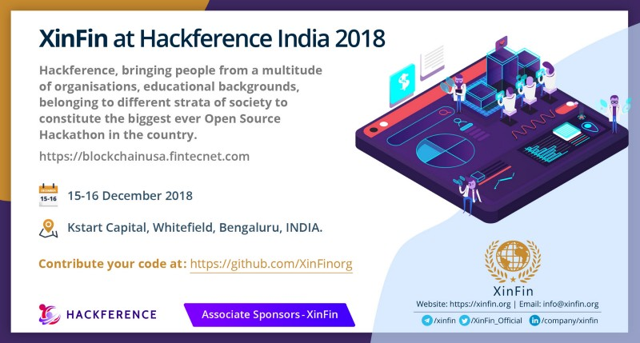

# Hackference 2018
Hackference is bringing people from a multitude of organisations, educational backgrounds, belonging to different strata of society to constitute the Biggest Ever Open Source Hackathon the country has ever seen. XinFin is an Associate Sponsor in the event, along with Google and ABinBev.

## ProblemStatements

### Problem-Statement 1
What are the possible use cases of blockchain with trade and finance that have not been explored or aren’t popular yet?

### Problem-Statemet 2
Have you tried addressing any common PROBLEM using BLOCKCHAIN before? If YES, elaborate about the PROBLEM and the SOLUTION for the same.

### Problem-Statement 3
Blockchain industry is yet to be utilised at the max and we see new use-cases emerging daily. How according to you can tokenisation improve traditional way of doing business?

### Submissions:
Read about the Submission Guidelines [here](../SubmissionGuide)
