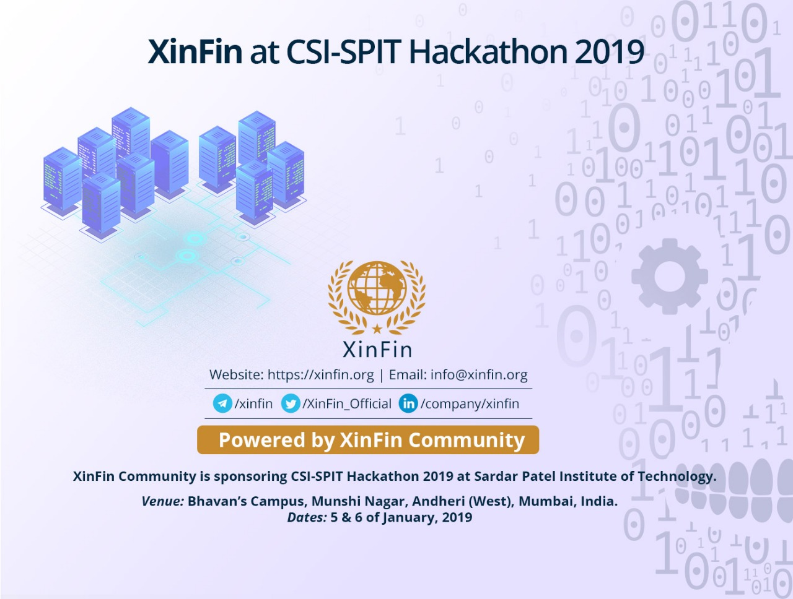

# Problem Statements for SPIT Hackathon

## VISION
To innovate and replace existing non-efficient closed systems with more transparent, efficient system using blockchain.

## NOTE :
1. Each problem statement is designed to be a strong, practical blockchain based solution and hence every solution for the problem statement stated below must be built around / using XDC blockchain.
2. Participants are given complete freedom for choosing technology, software architecture, programming languages etc. in the development of the application.
3. People have to use XDC blockchain mandatorily. ( link :[XDC docker nodes](https://github.com/XinFinOrg/XDC01-docker-Nnodes ) )
4. Problem statements are meant to be generic in order to give participants flexibility to work around.
5. Any other questions post them on this channel : [Channel Link](https://xinfin-public.slack.com/messages/CELR2M831/)

## Submission Guidelines
 [Submission Guidelines](../SubmissionGuide).

## PROBLEM STATEMENTS :

* Certification using Blockchain
Right now there are “n” number of ways to create a duplicate certificate online, available at the click of your mouse on the internet. Not only does it reduce the significance of a certificate but it also becomes impossible to verify authenticity of the certificate if one is presented.
The aim is to build a decentralized application which by using Smart contracts can create an immutable version of a document which can be verified by concerned parties.

* Pick any problem you see in your daily life & figure out how blockchain fits into it and why that problem should be addressed by blockchain. Give a solution using only blockchain or using blockchain in conjunction with any other technology of your choice.

* Blockchain industry is yet to be utilised at the max and we see new use-cases emerging daily. How according to you can tokenisation improve traditional way of doing business? You can use XinFin’s MyContract’s API to create a token for free.

* Healthcare
Make a blockchain based solution to address any issues in the current Healthcare system.
For e.g. : Right now there is not an efficient & secure system to maintain patient’s health records, prescriptions are handed out in paper which can be easily forged. There is no system which accumulates all the medical records of a person in a secure manner & gives complete history of a patient’s medical record.

* Change Proof of Work (PoW) Consensus in blockchain: Too much energy consumption makes PoW consensus non practical and not suitable for real world system. We need to find out other innovative consensus where transaction and network remains de-centralised but without much energy consumption. Research is being done in such consensus like DPOS ( delegated proof of stake ). Propose & implement such a consensus.

## Reference Material

Link to reference repositories : [Reference](../References).
